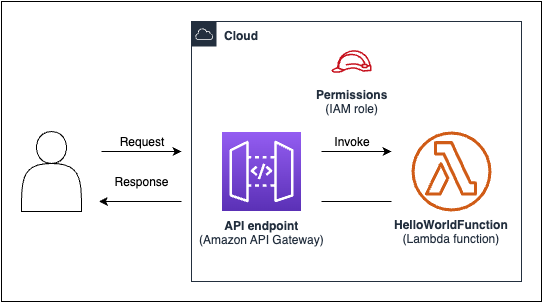

## AWS Lambda SnapStart with X-Ray

This is a sample application to demonstrate using X-Ray with SnapStart enabled AWS Lambda function. You can find more details about this feature in [launch blog](https://aws.amazon.com/blogs/compute/debugging-snapstart-enabled-lambda-functions-made-easy-with-aws-x-ray) post. 

The sample application is a simple Hello World application with the following architecture

### Deployment

#### Pre-requisites
1. AWS Account
2. Java 17
3. Maven
3. AWS [SAM CLI](https://docs.aws.amazon.com/serverless-application-model/latest/developerguide/install-sam-cli.html) v1.82.0

#### CLI Commands

1.	Clone the git repository and change to project directory

	$ git clone https://github.com/aws-samples/aws-lambda-snapstart-xray-example.git

2.	Use the AWS SAM CLI to build the application

    $ sam build

3.	Use the AWS SAM CLI to deploy the resources to your AWS account.

    $ sam deploy -g

This will deploy your Lambda function with SnapStart along with AWS X-Ray tracing. It will also deploy an API pointing to the alias of your Lambda function as the backend integration

## Security

See [CONTRIBUTING](CONTRIBUTING.md#security-issue-notifications) for more information.

## License

This library is licensed under the MIT-0 License. See the LICENSE file.

